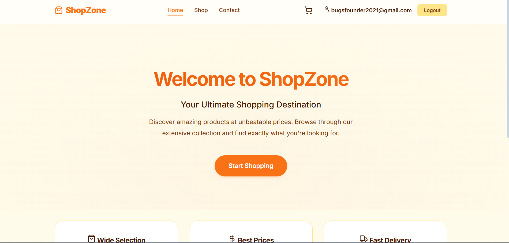
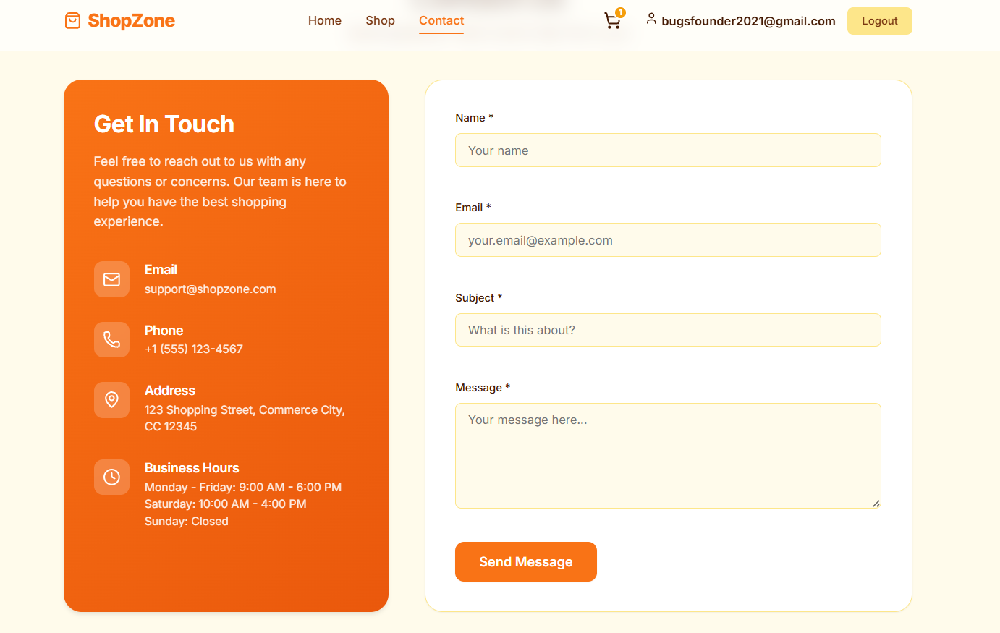
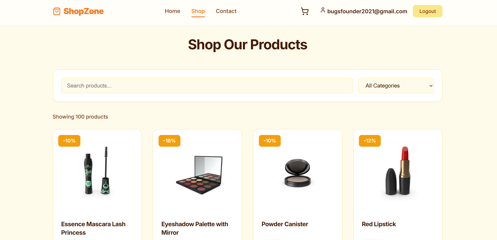
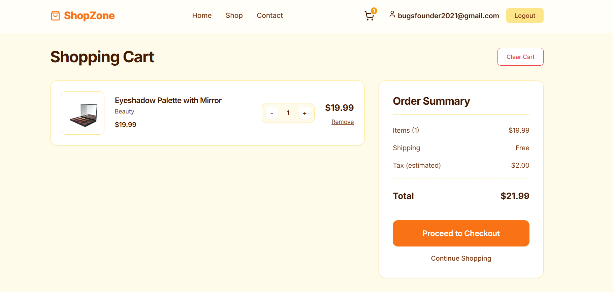

# Shopzone

Shopzone is a modern e-commerce application built with React and Vite, featuring a responsive design and seamless user experience.

## Features

- **Product Browsing**: Explore a wide range of products in our shop.
- **Detailed Product Views**: View detailed information for each product.
- **Shopping Cart**: Add items to your cart and manage quantities.
- **User Authentication**: Secure login and protected checkout routes.
- **Checkout Process**: Streamlined checkout experience.
- **Contact Form**: Easy way to get in touch.

## Screenshots






## Tech Stack

- **Frontend**: React, React Router Dom
- **Build Tool**: Vite
- **Icons**: Lucide React
- **Styling**: CSS (Custom properties and responsive design)

## Getting Started

1.  **Clone the repository**
2.  **Install dependencies**:
    ```bash
    npm install
    ```
3.  **Run the development server**:
    ```bash
    npm run dev
    ```
4.  **Build for production**:
    ```bash
    npm run build
    ```

    

## Project Structure

- `src/components`: Reusable UI components (Navbar, Footer, etc.)
- `src/pages`: Page components (Home, Shop, Product, Cart, etc.)
- `src/context`: React Context for state management (Auth, Cart)
- `public`: Static assets
